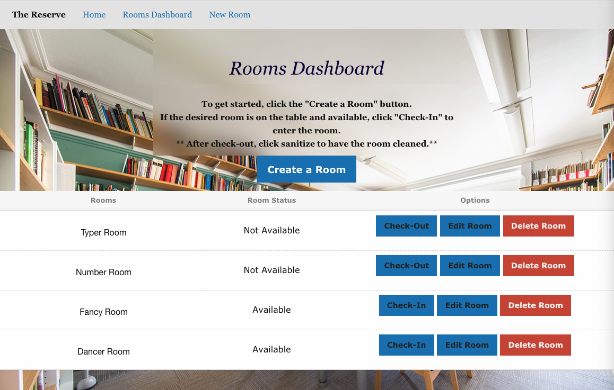

# The Reserve 

[The Reserve Site](https://still-ravine-68015.herokuapp.com/)

## Description 

The Reserve is a room reservation app that allows college campus library managers to create a log of study rooms. In doing so, it's easier for the manager to keep track of which rooms are in use, empty, or in need of cleaning. 

Technologies used:

SweetAlert2 was used to help with validation. To use it, the Css and Javascript files have to be imported from the SweetAlert2 website. Applied on all pop up messages on the app.
[SweetAlert2](https://www.npmjs.com/package/sweetalert2)

Front End Framework
Foundation advanced responsive front-end framework used for building website front-ends and app UI. 

- Handlebars
- Express-handlebars
- MySQL2
- Sequelize
- Jaws Database
- Heroku

## Table of Contents

* [Description](#description)
* [User Story](#user-story)
* [Usage](#usage)
* [Credits](#credits)
* [License](#license)
* [Sources](#sources)

## User Story

AS a library manager, who is cautious of COVID-19.
I WANT to be able to create a study room, change the availability of the room, and clean the room after each use.

## Usage 
Once a student is checked into a room, the room's status becomes "Not Available." After check-out, the room's status does not become "Available" until the room has been sterilized (using the "sanitize" feature). Sanitization after each use of a room is suggested in accordance with COVID safety purposes. Later versions of the app will allow documentation of student names and the time at which reservations are opened, for use with contact tracing.

## Credits
* [Garrett Lee](https://github.com/rgl10d)
* [Irene Asay](https://github.com/IreneAsay)
* [Val Kimani](https://github.com/Valkimani)
* [Ashley Ikeh](https://github.com/Aikeh2021)

## License

MIT License

Copyright © [2020] Garrett Lee, Irene Asay, Valentine Kimani, Ashley Ikeh

Permission is hereby granted, free of charge, to any person obtaining a copy
of this software and associated documentation files (the "Software"), to deal
in the Software without restriction, including without limitation the rights
to use, copy, modify, merge, publish, distribute, sublicense, and/or sell
copies of the Software, and to permit persons to whom the Software is
furnished to do so, subject to the following conditions:

The above copyright notice and this permission notice shall be included in all
copies or substantial portions of the Software.

THE SOFTWARE IS PROVIDED "AS IS", WITHOUT WARRANTY OF ANY KIND, EXPRESS OR
IMPLIED, INCLUDING BUT NOT LIMITED TO THE WARRANTIES OF MERCHANTABILITY,
FITNESS FOR A PARTICULAR PURPOSE AND NONINFRINGEMENT. IN NO EVENT SHALL THE
AUTHORS OR COPYRIGHT HOLDERS BE LIABLE FOR ANY CLAIM, DAMAGES OR OTHER
LIABILITY, WHETHER IN AN ACTION OF CONTRACT, TORT OR OTHERWISE, ARISING FROM,
OUT OF OR IN CONNECTION WITH THE SOFTWARE OR THE USE OR OTHER DEALINGS IN THE
SOFTWARE.

## Sources:

* [jQuery CDN Link](https://code.jquery.com)
* [Creating And Merging Branches In Git](https://www.youtube.com/watch?v=S2TUommS3O0)
* [Working With Related Tables-About Relationships](https://fmhelp.filemaker.com/help/18/fmp/en/index.html#page/FMP_Help/one-to-many-relationships.html)
* [Installing Foundation](https://get.foundation/sites/docs/installation.html)
* [Dashboard Template From Foundation](https://get.foundation/building-blocks/blocks/dashboard-table.html)
* [How to delete a file in iTerm](https://www.google.com/search?client=safari&rls=en&q=remove+a+file+in+iterm&ie=UTF-8&oe=UTF-8)
* [How to delete a directory in iTerm](https://www.google.com/search?client=safari&rls=en&biw=1249&bih=664&sxsrf=ALeKk00ljlp-6nvInVQu0OcEzyt-fjqoSg%3A1607789587587&ei=E-zUX8irI-LM5gLDvaqoCg&q=mac+terminal+rm+-rf&oq=mac+terminal+rm+-rf&gs_lcp=CgZwc3ktYWIQAzIECAAQRzIECAAQRzIECAAQRzIECAAQRzIECAAQRzIECAAQRzIECAAQRzIECAAQR1AAWABgr_owaABwAngAgAEAiAEAkgEAmAEAqgEHZ3dzLXdpesgBCMABAQ&sclient=psy-ab&ved=0ahUKEwiIgff56sjtAhViplkKHcOeCqUQ4dUDCAw&uact=5)
* [Using Foundation Building Blocks](https://get.foundation/building-blocks/how-to.html#what-is)
* [How to Use A Foundation Building Block](https://get.foundation/building-blocks/how-to.html#use)
* [Register For An Account Form From Foundaiton](https://get.foundation/building-blocks/blocks/form-icons.html)
* [Foundation Buttons](https://get.foundation/sites/docs-v5/components/buttons.html)
* [Rest vs Crud: Explaining Rest and Crud Operations](https://www.bmc.com/blogs/rest-vs-crud-whats-the-difference/#:~:text=CRUD%3A%20Foundation%20and%20Principles&text=CRUD%20is%20an%20acronym%20for,as%20primitive%20guidance%2C%20at%20best.)
* [The 7 Restful Routes!](https://medium.com/@shubhangirajagrawal/the-7-restful-routes-a8e84201f206)
* [Permissions Error](https://www.reddit.com/r/javascript/comments/8iygni/please_help_permission_errors_with_npm/)
* [Sequelize DataTypes](https://sequelize.org/v5/manual/data-types.html)
* [jQuery Text Method](https://www.w3schools.com/jquery/html_text.asp)
* [jQuery On Method](https://www.w3schools.com/jquery/event_on.asp)
* [event.PreventDefault() Method](https://www.w3schools.com/jquery/event_preventdefault.asp)
* [SweetAlert2](https://sweetalert2.github.io/#showLoading)
* [Handlebars](https://handlebarsjs.com/guide/#what-is-handlebars)
* [Prevent SweetAlert to Be Closed](https://stackoverflow.com/questions/47749095/prevent-sweetalert-to-be-closed-on-clicking-outside-the-popup-window)
* [HTTP Error Types](https://www.restapitutorial.com/httpstatuscodes.html)

